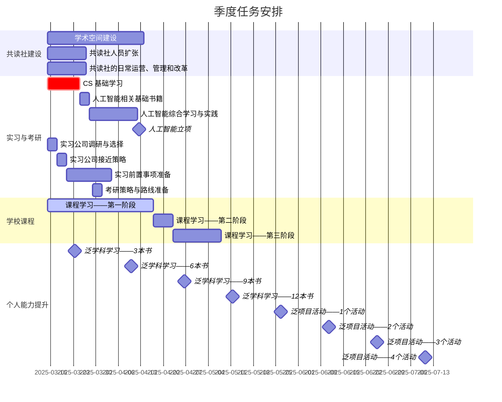

```mermaid
gantt
    title 季度任务安排
    dateFormat YYYY-MM-DD
    section  共读社建设
        学术空间建设          :a1, 2025-03-15, 30d
        共读社人员扩张 :2025-03-15, 12d
        共读社的日常运营、管理和改革 :2025-03-15, 12d
      


		section  实习与考研
        CS 基础学习 :crit,2025-03-15, 10d
        人工智能相关基础书籍    :3d
        人工智能综合学习与实践 : 15d
        人工智能立项    :milestone,1d
        实习公司调研与选择    :2025-03-15, 3d
        实习公司接近策略   :3d
        实习前置事项准备    :14d
        考研策略与路线准备   :2025-03-29,3d


 		section  学校课程
        课程学习——第一阶段     :active,2025-03-15, 33d
        课程学习——第二阶段    :6d 
        课程学习——第三阶段    :15d 


		section  个人能力提升
        泛学科学习——3本书    :milestone,2025-03-15, 17d
        泛学科学习——6本书    :milestone, 18d
        泛学科学习——9本书    : milestone,15d
        泛学科学习——12本书    :milestone, 15d
        泛项目活动——1个活动    :milestone, 15d
        泛项目活动——2个活动    : milestone,15d
        泛项目活动——3个活动    : milestone,15d
        泛项目活动——4个活动    : milestone,15d


```